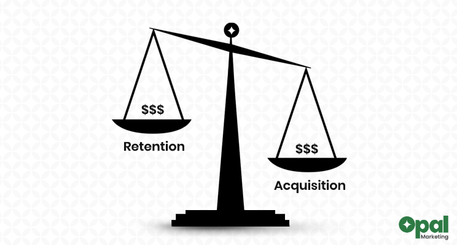

# Predicting Customer Churn

## Overview

In this project, I assumed the role of a data scientist at a ficticious bank in Europe. The analytics team noticed that the bank was losing customers, leading to a decline in revenue. I was tasked with developing a model that predicts which customers are likely to churn, enabling the marketing team to implement targeted retention strategies while minimising customer acquisition costs.

The customer dataset used in this project was obtained from [kaggle](https://www.kaggle.com/shrutimechlearn/churn-modelling). The dataset contains labelled examples of customers who have left and those who still have open accounts,

### Exploratory Data Analysis

The dataset contains 10,000 customer records with 13 features, including demographic information and account details. No missing values or data type inconsistencies were found in the dataset.

I used a heatmap to visualise the correlation between each feature in the dataset in order to determine whether there is a relationship between them. The heatmap showed that all features, with the exception of Age, which has the highest correlation coefficient of 0.29 with the target feature, have very low correlations with each another.

I created a bar plot of the target feature to see the distribution of the number of customers who left and those who stayed. This revealed that roughly 80% of customers stayed and 20% left. Further analysis revealed that each class's credit score, age, and account balance appear to be normally distributed, with the exception of estimated salary, which appears to be uniformly distributed.

### Model Building

I used a decision tree classifier to build the churn prediction model because of its ability to handle non-linear relationship between features.  The model-development process is as follows:

Step 1: Use stratified sampling technique to split the data into train, validation, and test sets. 
Step 2: Use random oversampling to address class imbalance in the training set. 
Step 3: Create a baseline model that always predicts the majority class seen in the training set. 
Step 4: Evaluate the model using accuracy and recall scores. 
Step 5: Train and compare a decision tree model to the baseline model. 

I chose recall score as the primary performance metric for evaluating model performance because accuracy score does not fully describe how well the model predicts customers who are likely to churn.

To keep the decision tree classifier from overfitting the training dataset, I used a hyperparameter tuning method to determine the optimal maximum depth for the tree. On the test set, the best decision tree classifier had accuracy and recall scores of 0.78 and 0.76, respectively. I used ensemble methods to improve the model's performance, which resulted in higher accuracy and precision but lower recall scores. Since recall was crucial to the aim of the project, I decided that the optimised decision tree classifier is the best model for predicting churn.

### Communicating Results

I developed an interactive dashboard to communicate the model's performance to stakeholders. The dashboard showed the model's evaluation metrics, as well as the estimated cost of client acquisition and retention, as well as the amount saved due to the model's precision at various probability thresholds on a test set. The best model saved 27,900 euros out of an estimated 81,400 euros in client acquisition costs, assuming customer acquisition and retention costs of 200 and 50 euros, respectively. You can access the dashboard using this [link](https://huggingface.co/spaces/Tiloye/Churn_Model_Performance_Metrics).
